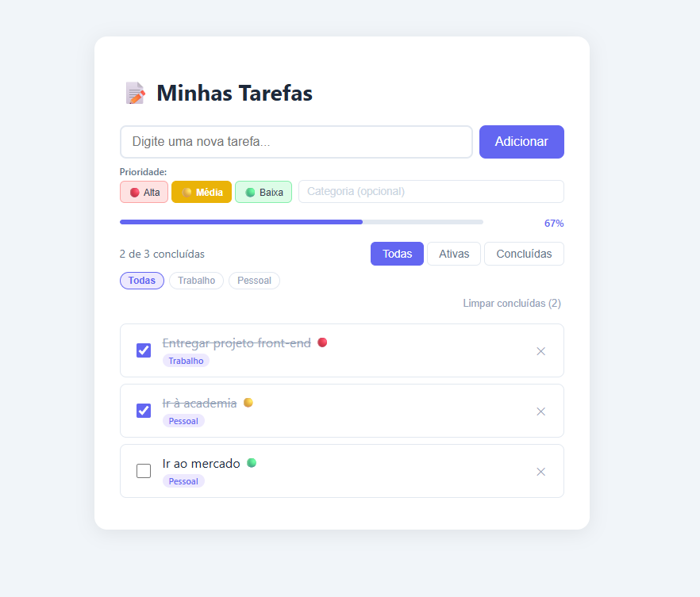

# 📝 To-Do List

Aplicação de gerenciamento de tarefas desenvolvida com **Next.js 16**, **TypeScript** e **Styled Components**.



## ✨ Funcionalidades

- ✅ Adicionar, concluir e deletar tarefas
- 🔴🟡🟢 Prioridade por tarefa (alta, média, baixa)
- 🏷️ Categorias personalizadas com filtro por tag
- 🔍 Filtros: Todas / Ativas / Concluídas
- 📊 Barra de progresso visual
- 🗑️ Limpar todas as tarefas concluídas de uma vez
- 💾 Persistência via `localStorage` — as tarefas ficam salvas no navegador
- 🎞️ Animações com **Framer Motion**
- 📱 Layout responsivo (mobile-first)

## 🛠️ Tecnologias

- [Next.js 16](https://nextjs.org/) — framework React com App Router
- [TypeScript](https://www.typescriptlang.org/) — tipagem estática
- [Styled Components](https://styled-components.com/) — estilização com CSS-in-JS
- [Framer Motion](https://www.framer.com/motion/) — animações

## 🚀 Como rodar localmente

```bash
# Clone o repositório
git clone https://github.com/paulorocha-dev/todo-nextjs

# Entre na pasta
cd my-todo-app

# Instale as dependências
npm install

# Rode em modo de desenvolvimento
npm run dev
```

Acesse [http://localhost:3000](http://localhost:3000) no navegador.

## 📁 Estrutura do projeto

```
app/
├── components/
│   ├── NovaTarefa.tsx        # Formulário de criação de tarefa
│   ├── ItemTarefa.tsx        # Item individual da lista
│   ├── FiltroTarefas.tsx     # Filtros e categorias
│   └── ProgressBar.tsx       # Barra de progresso
├── hooks/
│   └── useTarefas.ts         # Lógica e estado global das tarefas
├── types/
│   └── task.ts               # Tipagens (Task, Filtro, Prioridade)
├── layout.tsx
├── page.tsx
└── registry.tsx              # Configuração do Styled Components (SSR)
```

## 🌐 Deploy

Aplicação disponível em: [https://todo-nextjs-amber-ten.vercel.app](https://todo-nextjs-amber-ten.vercel.app)

---

Desenvolvido por [Paulo Henrique Rocha](https://github.com/paulorocha-dev)